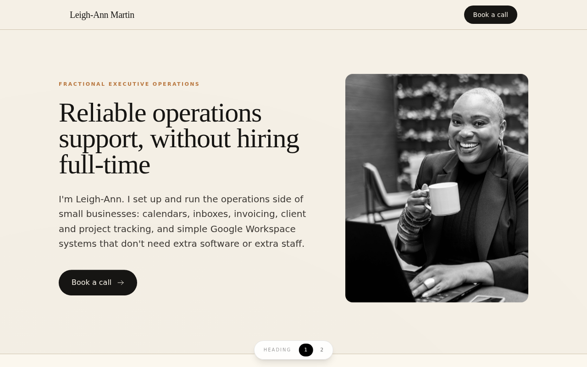
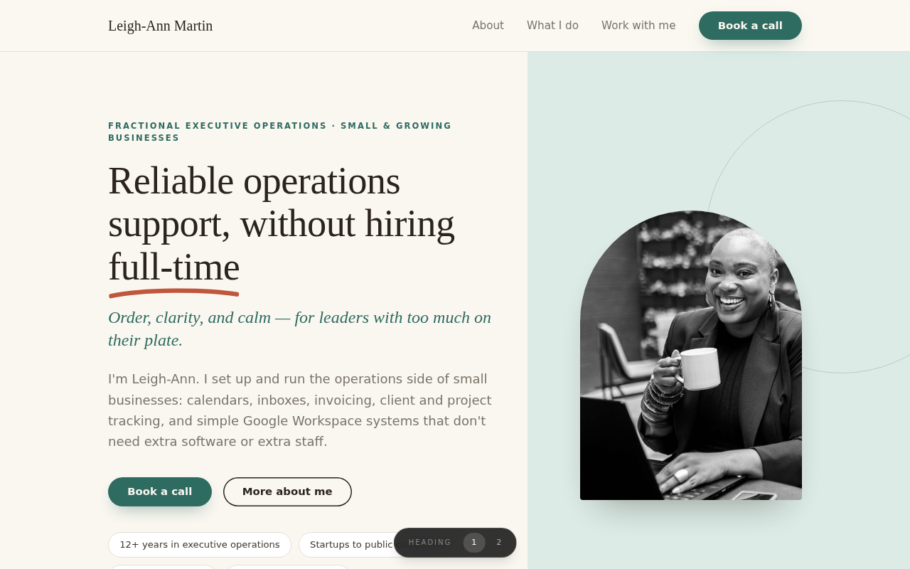
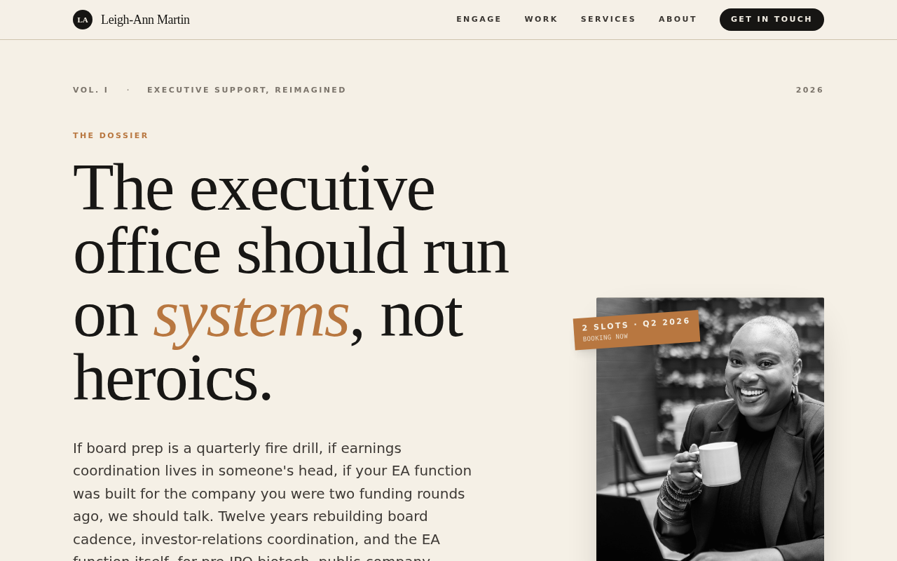
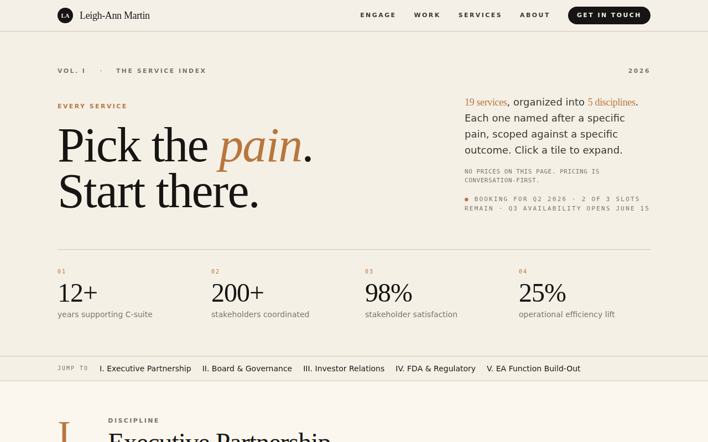
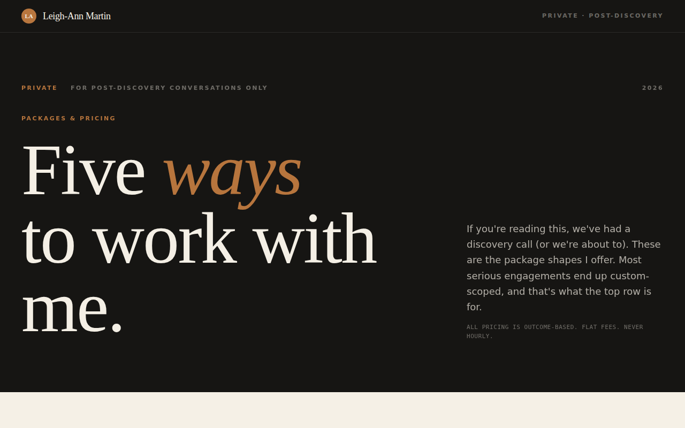
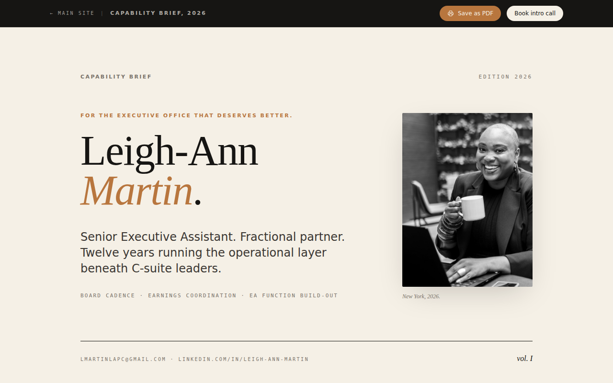
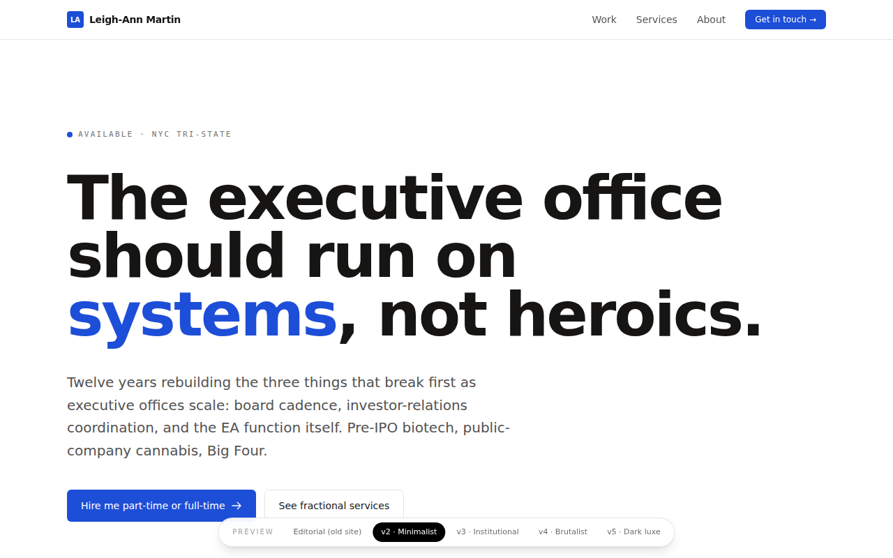
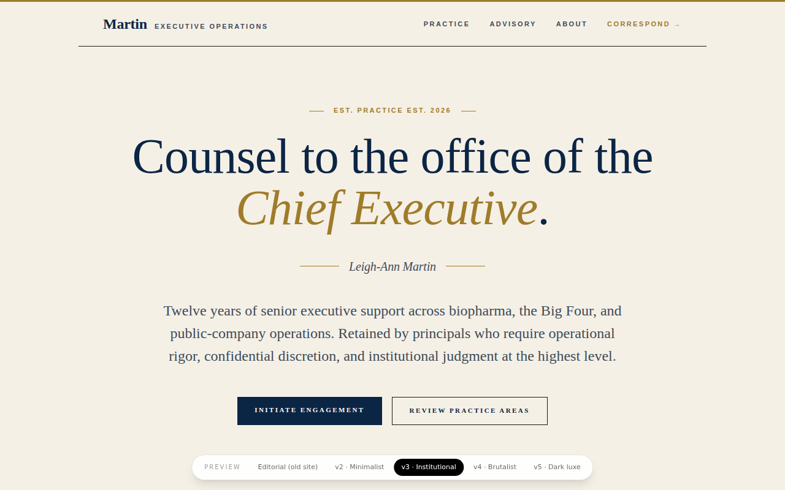
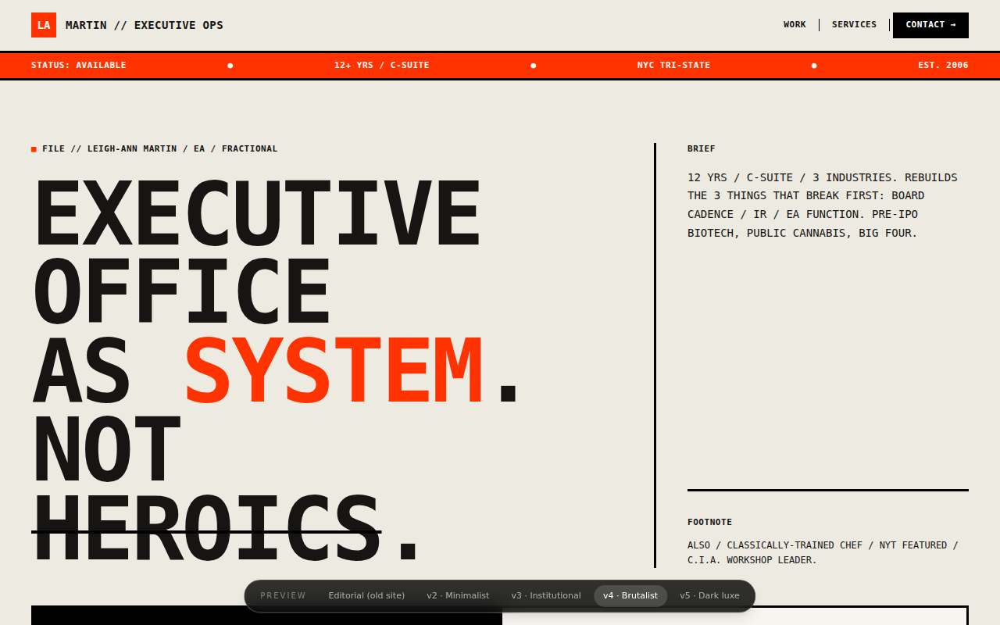
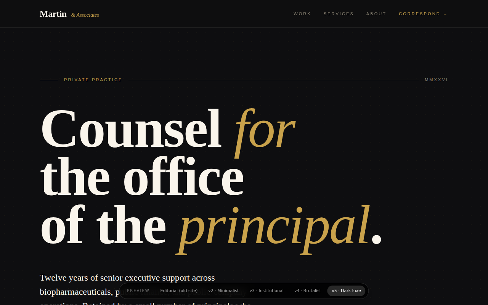

# Leigh-Ann Martin — services site

Astro + Tailwind static site, deployed to GitHub Pages on every push to `main`.

**Live base URL:** https://izzydoesizzy.github.io/leigh-ann-services/
**Page directory (in the browser):** https://izzydoesizzy.github.io/leigh-ann-services/archive

The repo holds several versions of the site side by side. This file is the map. Every page below has a header screenshot (first screen at 1280px) and a full-page screenshot in [`docs/screenshots/`](docs/screenshots/). Click any full-page thumbnail to open it at full size.

---

## 1. Current candidates

The simplified one-page site, built in October 2026 from Leigh-Ann's outline: hero, about, core skills, who she works with, industries, two case studies, done by / with / for you, 1–3 month engagement terms, and a single **Book a call** button. No pricing on the page (pricing lives in the intake form). Same content in two visual themes.

| | Homepage | Teal & Clay |
|---|---|---|
| **Live** | https://izzydoesizzy.github.io/leigh-ann-services/ | https://izzydoesizzy.github.io/leigh-ann-services/new |
| **Source** | `src/pages/index.astro` | `src/pages/new.astro` |
| **Theme** | Editorial: ivory paper, near-black ink, copper accent. Fraunces + Inter. | Teal & Clay: ivory, sage colour block, teal accent, one clay flourish. Fraunces + Figtree. Ported from Variation C of the `leigh-ann-ea` repo's `/v10/heroes` explorations. |
| **Differs by** | Keeps the palette of the previous site, so it reads as a trimmed-down version of it. | Warmer and softer. Arch-shaped portrait, stat pills under the hero, cards for skills and case studies, sage band for packages, dark footer. |
| **Indexed** | Yes | No (preview) |
| **Header** |  |  |
| **Full page** | [](docs/screenshots/home-full.jpg) | [](docs/screenshots/new-full.jpg) |

Both use the same `BOOK_CALL_URL` constant at the top of their page file. It currently points at Calendly; swap it for the Google intake form when that's ready.

**Heading picker.** Both pages have a floating "Heading 1 / 2" pill at the bottom so Leigh-Ann can flip between candidate hero headings. The candidates (title + lead paragraph) live in `src/data/headings.ts`; the pill is `src/components/HeadingSwitcher.astro`. Append `?heading=2` to a URL to open a page on a given heading. Once she's chosen, delete the unused entry, remove the `<HeadingSwitcher>` from both pages and the `data-heading-*` hooks in their heroes.

---

## 2. Previous site (editorial)

The long-form fractional-EA site that was the homepage until October 2026, aimed at pre-IPO and public-company executives: personas, four engagement tiers, case studies with metrics, a skills matrix, FAQ, press. Kept intact under `/archive/editorial/` with its three subpages. All noindex.

| Page | Live | Source | What it is |
|---|---|---|---|
| Homepage | https://izzydoesizzy.github.io/leigh-ann-services/archive/editorial | `src/pages/archive/editorial/index.astro` | 17 sections. Assembled from the components in `src/components/editorial/`. |
| Services index | https://izzydoesizzy.github.io/leigh-ann-services/archive/editorial/services | `src/pages/archive/editorial/services.astro` | Catalogue of 37 services across disciplines. Linked from the editorial homepage. |
| Packages | https://izzydoesizzy.github.io/leigh-ann-services/archive/editorial/packages | `src/pages/archive/editorial/packages.astro` | Priced packages. Deliberately unlinked; shared only after a discovery call. |
| Capability brief | https://izzydoesizzy.github.io/leigh-ann-services/archive/editorial/capability-brief | `src/pages/archive/editorial/capability-brief.astro` | Dark, print-style one-pager version of the editorial site. |

| Homepage | Services index |
|---|---|
|  |  |
| [Full page](docs/screenshots/editorial-home-full.jpg) (very long) | [Full page](docs/screenshots/editorial-services-full.jpg) |

| Packages | Capability brief |
|---|---|
|  |  |
| [Full page](docs/screenshots/editorial-packages-full.jpg) | [Full page](docs/screenshots/editorial-capability-brief-full.jpg) |

---

## 3. Style mockups

Four alternative looks for the previous site, built to pick a visual direction. Content is a trimmed copy of the editorial homepage, so only the styling differs. Each has a floating "Preview" switcher at the bottom to jump between them. All noindex.

| Mockup | Live | Source | Look |
|---|---|---|---|
| Minimalist | https://izzydoesizzy.github.io/leigh-ann-services/archive/mockups/minimalist | `src/pages/archive/mockups/minimalist.astro` | White, Inter, hairlines. Quiet product-site feel. |
| Institutional | https://izzydoesizzy.github.io/leigh-ann-services/archive/mockups/institutional | `src/pages/archive/mockups/institutional.astro` | Navy, gold, serif. Law-firm / advisory feel. |
| Brutalist | https://izzydoesizzy.github.io/leigh-ann-services/archive/mockups/brutalist | `src/pages/archive/mockups/brutalist.astro` | Black, bone, mono. Heavy rules, uppercase, grid. |
| Dark luxe | https://izzydoesizzy.github.io/leigh-ann-services/archive/mockups/dark-luxe | `src/pages/archive/mockups/dark-luxe.astro` | Near-black, gold. High-contrast luxury feel. |

| Minimalist | Institutional |
|---|---|
|  |  |
| [Full page](docs/screenshots/mockup-minimalist-full.jpg) | [Full page](docs/screenshots/mockup-institutional-full.jpg) |

| Brutalist | Dark luxe |
|---|---|
|  |  |
| [Full page](docs/screenshots/mockup-brutalist-full.jpg) | [Full page](docs/screenshots/mockup-dark-luxe-full.jpg) |

---

## Old slugs

Slugs were flattened out in October 2026. If you have an old link:

| Old | Now |
|---|---|
| `/` (editorial homepage) | `/archive/editorial` |
| `/services` | `/archive/editorial/services` |
| `/packages` | `/archive/editorial/packages` |
| `/capability-brief` | `/archive/editorial/capability-brief` |
| `/v2` (mockup) | `/archive/mockups/minimalist` |
| `/v3` | `/archive/mockups/institutional` |
| `/v4` | `/archive/mockups/brutalist` |
| `/v5` | `/archive/mockups/dark-luxe` |

---

## Repo layout

```
src/
  pages/
    index.astro                  /                       simplified site, editorial theme
    new.astro                    /new                    simplified site, teal & clay theme
    archive/
      index.astro                /archive                directory of every page
      editorial/                 /archive/editorial/…    previous site + subpages
      mockups/                   /archive/mockups/…      four style mockups
  layouts/
    EditorialLayout.astro        loads styles/editorial.css (used by /, archive/editorial, mockups)
    TealLayout.astro             loads styles/teal.css     (used by /new, /archive)
  styles/
    editorial.css                ivory / ink / copper tokens, Fraunces + Inter
    teal.css                     ivory / sage / teal / clay tokens, Fraunces + Figtree
  components/
    editorial/                   sections of the previous site (Masthead, Overture, TwoPaths, …)
    mockups/VariantSwitcher.astro
    HeadingSwitcher.astro        floating picker for the candidate hero headings on / and /new
  data/
    headings.ts                  candidate hero headings (title + lead paragraph) for / and /new
    pull-quotes.ts               anonymised testimonials used by the editorial pages
public/portrait.jpg              the one portrait every version uses
docs/screenshots/                header (PNG) + full-page (JPG) shots of every page
```

The two stylesheets are independent: each imports Tailwind and declares its own `@theme`, so a page only ever gets the tokens of the layout it uses.

## Working on it

```
pnpm install
pnpm dev        # http://localhost:4321/leigh-ann-services/
pnpm build      # output in dist/
```

Pushing to `main` deploys everything in `dist/` to GitHub Pages via `.github/workflows/deploy.yml`. Work on a branch and merge when ready.

**Share images** (the preview card when a link is pasted into LinkedIn, iMessage, Slack, etc.): `public/og.png` for `/` and `public/og-new.png` for `/new`, both 1200×630. They're rendered from `scripts/og/template.html` with `node scripts/og/render.mjs` (needs Playwright). The headline is hard-coded in the template; update it there once Leigh-Ann picks a heading, re-run, and commit the PNGs. Add `--all` to dump the other four concepts into `scripts/og/out/`.

**Refreshing the screenshots** after a visual change: run `pnpm build && pnpm preview`, then take a 1280px-wide header shot (800px tall viewport) and a full-page JPEG for each page and drop them in `docs/screenshots/` using the existing names.

**Adding a page:** put it under `src/pages/`, add a row to the `/archive` directory (`src/pages/archive/index.astro`) and to this README, and add its screenshots.
